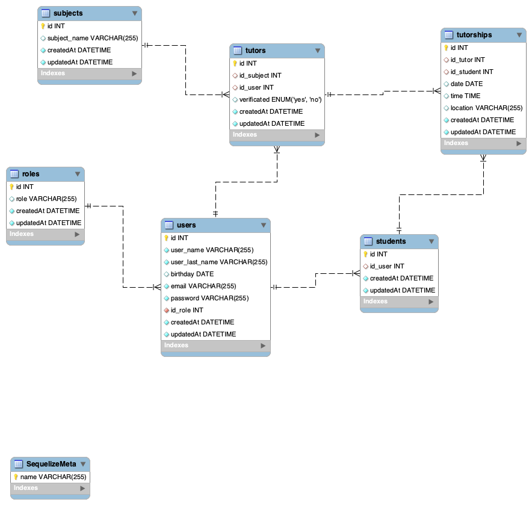

# TeachMe Backend API para gestión de base de datos.

<details>
  <summary>Contenido 📝</summary>
  <ol>
    <li><a href="#objetivo">Objetivo</a></li>
    <li><a href="#sobre-el-proyecto">Sobre el proyecto</a></li>
    <li><a href="#stack">Stack</a></li>
    <li><a href="#diagrama-bd">Diagrama</a></li>
    <li><a href="#instalación-en-local">Instalación</a></li>
    <li><a href="#endpoints">Endpoints</a></li>
    <li><a href="#futuras-funcionalidades">Futuras funcionalidades</a></li>
    <li><a href="#contacto">Contacto</a></li>
  </ol>
</details>

## Objetivo

Este proyecto requería una API funcional conectada a una base de datos creando endpoints para la obtención de datos.

## Sobre el proyecto

Es una aplicación dedicada a contactar a alumnos que necesiten o quieran dar
clases particulares. Está enfocada tanto para aquellos alumnos que necesitan a un
profesor particular como aquellos estudiantes que se quieren sacar un dinero extra.
Una vez que se inicie la sesión de usuario podrá seleccionar su rol de profesor o
alumno. Dentro podrás colgar tu oferta de clases y otros alumnos podrán verla para
poder contactar contigo.

El objetivo es reducir el fracaso escolar, ayudando a los jóvenes con éste problema.
Busco crear un portal en el que tanto estudiantes de cursos superiores puedan sacar un
dinero extra, como a los estudiantes de cursos menores puedan ver de nuevo lo que no
han podido aprender en las aulas o reforzar lo ya aprendido.

## Stack

Tecnologías utilizadas:

<div align="center">
<a href="https://sequelize.org/">
    
</a>
<a href="https://www.expressjs.com/">
    
</a>
<a href="https://nodejs.org/es/">
    
</a>
<a href="https://developer.mozilla.org/es/docs/Web/JavaScript">
    
</a>
 </div>

## Diagrama BD



## Instalación en local

1. Clonar el repositorio
2. `$ npm install`
3. Conectamos nuestro repositorio con la base de datos
4. `$ Ejecutamos las migraciones`
5. `$ Ejecutamos los seeders`
6. `$ npm run dev`

## Endpoints

<details>
<summary>Endpoints</summary>

- AUTH

  - Registrar usuario

        POST http://localhost:3000/auth/register

    body:

    ```js
        {
            // use which id_role do you want
            // 1 - admin
            // 2- tutor
            // 3 - student

        "user_name": "Steven",
        "user_last_name": "Garzon",
        "birthday": "1996-08-02",
        "email": "steven@garzon.com",
        "password": "12345678",
        'id_role': '3',
        }
    ```

  - Login

        POST http://localhost:3000/auth/login

    body:

    ```js
        {
            "email": "steven@garzon.com",
            "password": "12345678"
        }
    ```

- TUTOR

  - Obtener todos los estudientes

        GET http://localhost:3000/api/tutor/all-students?page=1

  - Obtener la lista de mis tutorias

        http://localhost:3000/api/tutor/my-tutorship?page=1

  - Actualizar alguna tutoria existente por id de la cita en params

        PUT http://localhost:3000/api/tutor/tutorship-update/1

    body:

    ```js
        {
            "date": "2023-08-27"
        }
    ```

- STUDENT

  - Obtener mi perfil.

        GET http://localhost:3000/api/student/my-profile

  - Actualizar mi perfil.

        PUT http://localhost:3000/api/student/update-profile

    body:

    ```js
        {
            "birthday": "1999-09-14"
        }
    ```

  - Crear una tutoria escogiendo el tutor.

        POST http://localhost:3000/api/student/tutorship-create

    body:

    ```js
        {
            // 1. Oliver Wilson (English)

                "id_tutor": 2,
                "date": "2023-11-10",
                "time": "11:30:00",
                "location": "Presential"

        }
    ```

- Obtener todas mis tutorias.

       GET http://localhost:3000/api/student/my-tutorships?page=1

 </details>

## Futuras funcionalidades

⬜ Futuros end points para la obtención detalla de la tutoria.</br>
⬜ Añadir asignaturas a los tutores.</br>
⬜ Gestion de las tutorias por parte del tutor y el estudientes (cambiar fecha, hora, dia y lugar)</br>

## Contacto

<a href="https://es.linkedin.com/in/mario-steeven-garz%C3%B3n-serna-27405a194" target="_blank"></a>

<a href="https://github.com/Stevengs7" target="_blank"></a>
